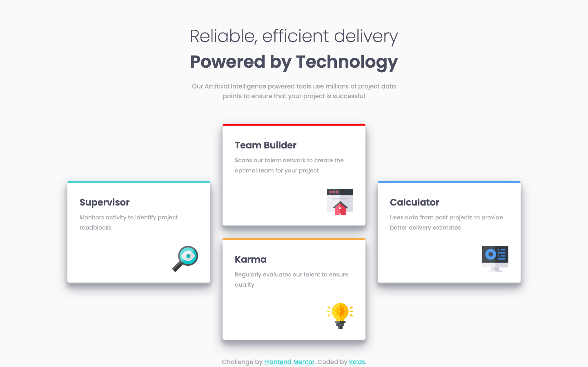
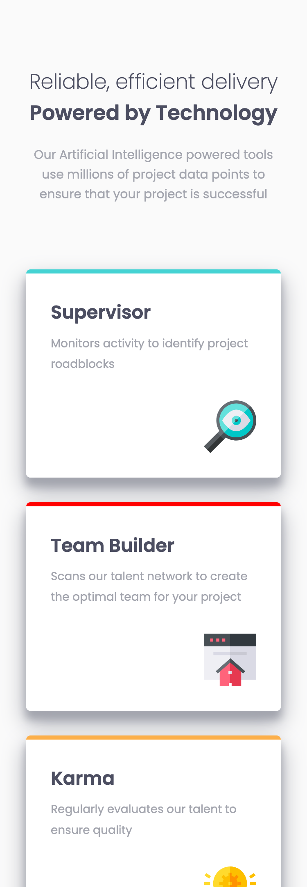
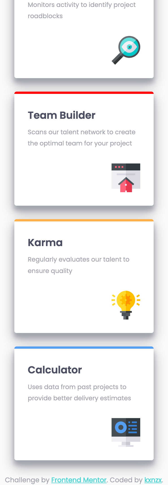
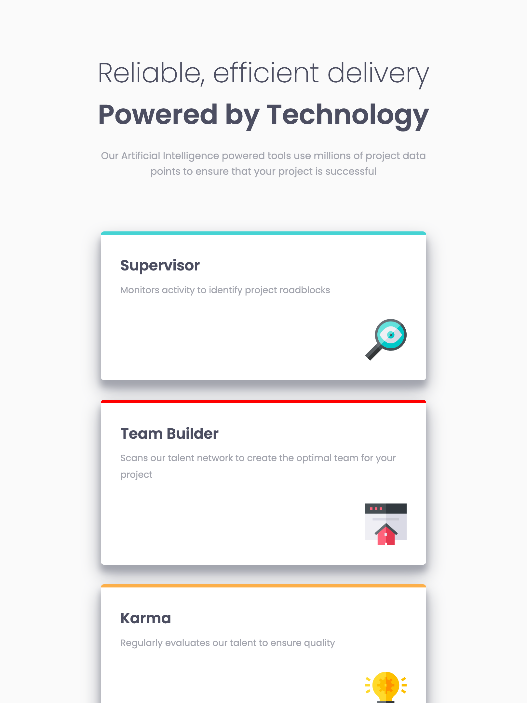
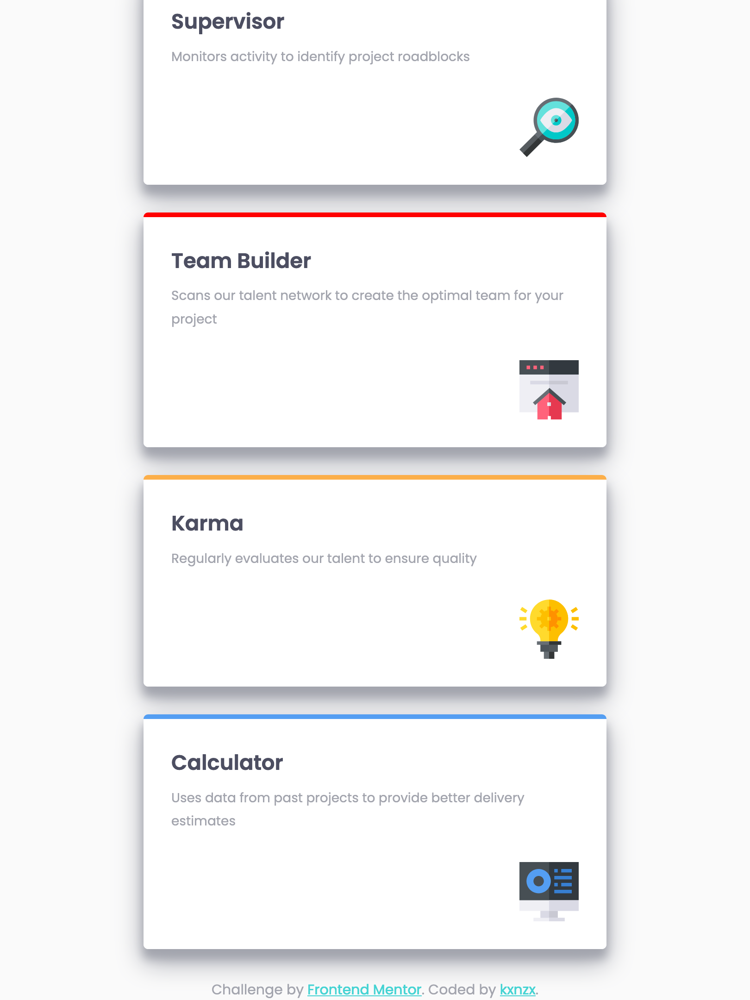

# Frontend Mentor - Four Card Feature Section Solution

This is a solution to the [Four card feature section challenge on Frontend Mentor](https://www.frontendmentor.io/challenges/four-card-feature-section-weK1eFYK). Frontend Mentor challenges help you improve your coding skills by building realistic projects.

## Table of contents

- [Overview](#overview)
  - [The challenge](#the-challenge)
  - [Screenshot](#screenshot)
  - [Links](#links)
- [My process](#my-process)
  - [Built with](#built-with)
  - [What I learned](#what-i-learned)
  - [Continued development](#continued-development)
- [Author](#author)

## Overview

### The challenge

Users should be able to:

- View the optimal layout for the site depending on their device's screen size

### Screenshots

#### Screensize 1440px - Desktop



#### Screensize 375px - Mobile



### Links

- View my Solution on [Frontend Mentor](https://www.frontendmentor.io/solutions/responsive-four-card-section-with-css-grid-sWP12XUbE)
- View the Live Site [here](https://kxnzx.github.io/four-card-section/)

## My process

- HTML semantics
- Importing Google Fonts
- Set variables in root
- Reset default settings
- Global Styles (Mobile First)
- Content Styles
- Layout Styles (Mobile First)
- Media Queries (Desktop)

### Built with

- Semantic HTML5 markup
- CSS custom properties
- CSS Grid
- Mobile-first workflow
- [Google Fonts](https://fonts.google.com/) - For Fonts

### What I learned

- Giving the header a max-width prevents it's content, (the text of the paragraph) from expanding on a wider screen:

```css
header {
  text-align: center;
  margin: 5rem auto;
  max-width: 600px;
}
```

- Initially I used Flexbox to position the icon in the card section, but I discovered a simpler alternative:

```css
.section__icon img {
  display: block;
  margin-left: auto;
  margin-top: 2rem;
}
```

### Continued development

I challenged myself to make a responsive design for an iPad/tablet. I changed the width of the section card so that it aligns with the width of the header:

#### Screensize 810px - iPad



The unwanted result with this was that the viewport height also got taller. For that reason I decided to leave it out of this challenge. Therefor one of my continued developments (besides CSS Grid ) will be media queries and viewports.

## Author

- Frontend Mentor - [@kxnzx](https://www.frontendmentor.io/profile/kxnzx)
